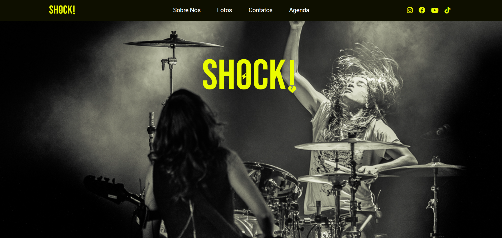

# Trabalho Prático 01 - Programação Para a Web (cliente)

## Live Version

**[Clique aqui! :)](https://carollimeres.github.io/TrabalhoPratico_01_Carolina/)**

## Sobre o Projeto

Website criado para a banda fictícia SHOCK! utilizando HTML, CSS e Bootstrap.
